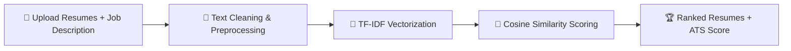

<div align="center">


<a href="https://git.io/typing-svg">
  
</a>

<br/><br/>


</div>

---

### 📄 About The Project

**Resume Screening System** is an NLP-based application that automatically screens, ranks, and scores resumes against a given job description — just like a real **Applicant Tracking System (ATS)**.

It helps recruiters shortlist the most relevant candidates in seconds instead of manually reading hundreds of resumes, and helps job seekers check how well their resume matches a job posting before applying.

```yaml
Project:      Resume Screening System
Type:         NLP · Text Classification · Information Retrieval
Goal:         Rank resumes by relevance to a job description
Output:       Ranked resume list + ATS match score (%)
```

---

### ✨ Key Features

- 📂 **Bulk Resume Upload** — Upload multiple resumes (PDF/DOCX) at once
- 🧠 **NLP Text Extraction & Cleaning** — Tokenization, stopword removal, lemmatization
- 🔢 **TF-IDF Vectorization** — Converts resume & job description text into numeric vectors
- 📊 **Cosine Similarity Ranking** — Ranks resumes by relevance to the job description
- 🎯 **ATS Score** — Gives each resume a match percentage score
- 🏆 **Top Candidate Shortlist** — Instantly view the best-matching resumes
- 📈 **Interactive Dashboard** — Clean, visual results built with Streamlit

---

### 🛠️ Tech Stack

<div align="center">


</div>

---

### ⚙️ How It Works



1. **Input** — Upload resumes (PDF/DOCX) along with a job description
2. **Preprocessing** — Text is cleaned: lowercasing, stopword removal, lemmatization
3. **Vectorization** — TF-IDF converts text into numerical feature vectors
4. **Scoring** — Cosine similarity compares each resume vector to the job description vector
5. **Ranking** — Resumes are sorted by similarity/ATS score, highest match first

---

### 🚀 Getting Started

**1. Clone the repository**
```bash
git clone https://github.com/shubhammore566/resume-screening-system.git
cd resume-screening-system
```

**2. Install dependencies**
```bash
pip install -r requirements.txt
```

**3. Run the app**
```bash
streamlit run app.py
```

---

### 📂 Project Structure

```
resume-screening-system/
├── app.py                 # Main Streamlit application
├── requirements.txt       # Project dependencies
├── data/                  # Sample resumes / job descriptions
├── utils/                 # Text preprocessing & scoring functions
└── README.md              # Project documentation
```

---

### 📈 Sample Output

| Rank | Candidate Resume | ATS Match Score |
|------|-------------------|:----------------:|
| 🥇 1  | resume_john.pdf    | 92%              |
| 🥈 2  | resume_priya.pdf   | 87%              |
| 🥉 3  | resume_alex.pdf    | 79%              |
| 4    | resume_maria.pdf   | 65%              |

---

### 🔮 Future Improvements

- 🤖 Use **BERT / Sentence Transformers** for semantic similarity (beyond TF-IDF)
- 📑 Add support for scanned/image-based resumes via OCR
- 🌐 Deploy as a public web app
- 📊 Add skill-gap analysis for each candidate

---

### 📫 Connect With Me

<div align="center">

[](mailto:shubhammore976525@gmail.com)
[](https://www.linkedin.com/in/shubham-more-a749b1333)
[](https://github.com/shubhammore566)

⭐ **If you found this project useful, don't forget to star the repo!**


</div>
